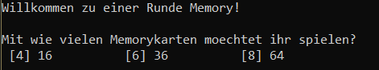
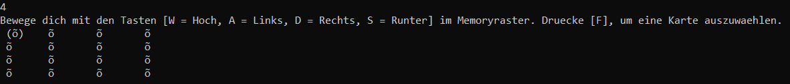
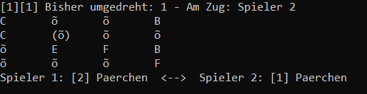
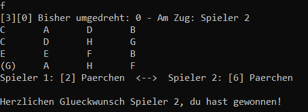

[🇩🇪 Deutsche Version](README_DE.md)

# Console Memory Game

A simple console-based memory card game written in Java.

## About the Project

This project is my first fully self-developed programming project. It intentionally serves as a retrospective of my early programming style and documents my growth as a software developer. Therefore, the code may still contain structural weaknesses, inefficient solutions, or smaller bugs.

## Features

* **1v1 Game Mode**
  Two players compete locally on the same keyboard. The goal is to uncover as many matching card pairs as possible.

* **Multiple Board Sizes**
  Before starting the game, players can choose between three difficulty levels:

  * `4x4` → 16 cards
  * `6x6` → 36 cards
  * `8x8` → 64 cards

* **Console-Based User Interface**
  The entire game runs inside the console.
  Controls:

  * `W`, `A`, `S`, `D` → Movement
  * `F` → Flip card
    Every input must be confirmed with `Enter`.

* **Automatic Game Evaluation**
  Once all card pairs have been found, the game automatically ends and displays the winner.

---

## Requirements

* **Java:** JDK 11 or higher
* **Operating System:** Windows, macOS, or Linux

---

## Installation & Launch

1. Clone or download the repository
2. Navigate into the project directory:

```bash
cd console-memory-game
```

3. Compile the Java files:

```bash
javac src/*.java
```

4. Start the game:

```bash
java -cp src Game
```

---

## Game Interface

The game exclusively uses extended ASCII characters to render the board.

### Card Backside

```text
õ
```

* ASCII code: `245`

### Card Fronts

The card fronts are based on ASCII characters starting from decimal value `65` (`A`).

| Board Size | Cards | Character Range                      |
| ---------- | ------ | ------------------------------------ |
| 4x4        | 16     | A–H                                  |
| 6x6        | 36     | A–R                                  |
| 8x8        | 64     | A–Z, `[`, `\`, `]`, `^`, `_`, `` ` `` |

### Cursor Indicator

If the player is currently positioned on a card, it is highlighted with brackets:

```text
(õ)
(A)
```

This indicates which card is currently selected and can be flipped using `F`.

---

## How to Play

### 1. Start the Game

Launch the program as described above.

### 2. Choose Board Size

Choose between:

* `4` → 4x4 board
* `6` → 6x6 board
* `8` → 8x8 board



### 3. Navigation

Move the cursor using the WASD keys:

* `W` → Up
* `A` → Left
* `S` → Down
* `D` → Right



### 4. Flip Cards

Press `F` to reveal the currently selected card.



### 5. Find Matching Pairs

* Each turn allows flipping two cards.
* If both cards match:

  * the pair remains visible
  * the player earns one point
  * the player gets another turn

### 6. Win the Game

The game automatically ends once all pairs have been found.
The player with the most points wins.



---

## Rules

* The game is played by **Player 1** and **Player 2**
* Player 1 always starts
* Each turn consists of flipping exactly two cards
* If both cards match:

  * they remain visible
  * the player earns a point
  * the player may continue playing
* If the cards do not match:

  * they are flipped back automatically
  * the next player takes their turn
* The game ends when all pairs have been found

---

## Display Recommendation

For the best gameplay experience, it is recommended to manually resize the console window according to the selected board size. This ensures that only the current game state is visible at any time, making movement across the board appear smoother and more immersive.

---

## Project Structure

```text
console-memory-game/
├── assets/
│   ├── ...
├── src/
│   ├── Game.java      # Main game logic and controller
│   ├── Player.java    # Player logic and movement
│   └── Card.java      # Card model
├── README_DE.md
├── README.md
├── LICENSE
└── .gitignore
```

---

## License

This project is licensed under the [MIT License](LICENSE).
